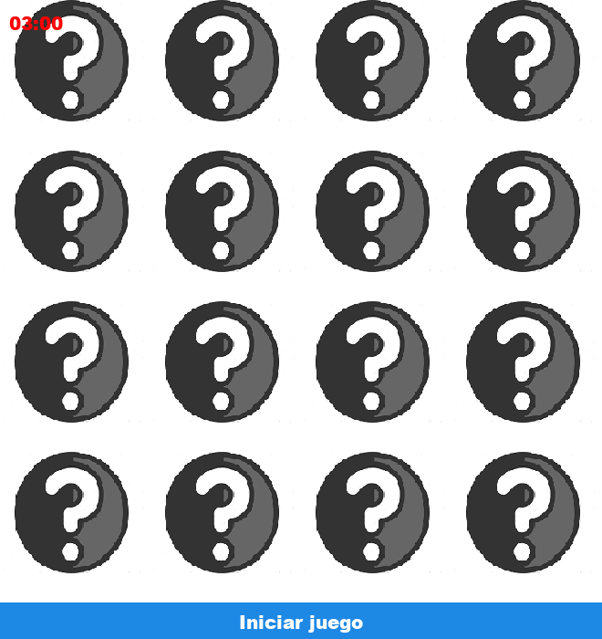
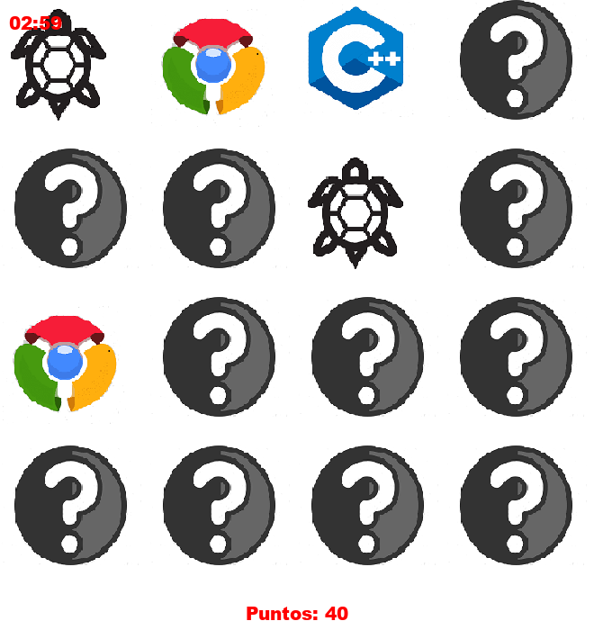
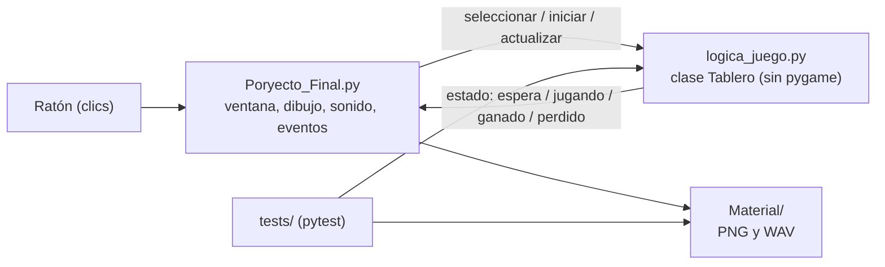

<div align="center">
  
  <h1>TechMemory</h1>
  <p><b>Juego de memoria en Pygame: encuentra los 8 pares de logotipos tecnológicos antes de que pasen 3 minutos.</b></p>
  
  
  
  
  <a href="https://github.com/Luiss2080/TechMemory/actions/workflows/ci.yml"></a>
  <p>
    <a href="#-inicio-rápido">Inicio rápido</a> ·
    <a href="#-características">Características</a> ·
    <a href="#%EF%B8%8F-arquitectura">Arquitectura</a> ·
    <a href="#-pruebas">Pruebas</a> ·
    <a href="#-lo-que-todavía-no-existe">Limitaciones</a>
  </p>
</div>

**TechMemory** (el título de la ventana es "CodePairs - Juego de memoria") es un juego en el que se
voltean cartas de a dos para encontrar los pares antes de que se acabe el tiempo.
Nació como proyecto de la asignatura Programación I (Universidad Privada Domingo
Savio, Facultad de Ingeniería; estudiantes Carlos Eduardo Salvatierra Chávez, Luis
Mario Rocha Vela y Jesús Enrique Salas Espinoza; docente Zambrana Chacón Jaime).
Es un juego de un solo jugador y una sola pantalla: **no** tiene menú, ranking,
pausa ni niveles.

## 🎬 Vista rápida

<table>
  <tr>
    <td align="center"><br /><sub>Pantalla inicial</sub></td>
    <td align="center"><br /><sub>Partida en curso (40 puntos)</sub></td>
  </tr>
</table>

> Son frames reales del propio juego, generados con `SDL_VIDEODRIVER=dummy` y
> `pygame.image.save` sin modificar el código (no incluyen el marco de la ventana).
> Los logotipos que aparecen son los de `Material/`, marcas de terceros: ver
> [limitaciones](#-lo-que-todavía-no-existe).

## ✨ Características

| Característica | Detalle |
|---|---|
| Tablero 4x4 | 8 pares de logotipos; el mazo se baraja en cada partida y cada logotipo sale exactamente dos veces |
| Cronómetro | Cuenta regresiva de **3 minutos** (180 s); al llegar a 0 se pierde |
| Par incorrecto | Queda visible 1 segundo y se oculta; mientras tanto no se aceptan más clics en cartas |
| Clics ignorados | Repetir la misma carta o pulsar una ya acertada no cuenta |
| Puntaje | 10 puntos por carta descubierta (20 por par, máximo 160) |
| Reintento | Al ganar o perder, el botón inferior rebaraja y reinicia tiempo, puntaje y selección |
| Sonido | Efectos (voltear, acierto, fallo, victoria) y música de fondo; sin dispositivo de audio arranca en silencio |

## 🏗️ Arquitectura



La lógica (`Tablero`, `Carta`) no depende de Pygame: el tiempo se inyecta como
parámetro `ahora`, lo que la hace determinista y testeable.

<details>
<summary>Estructura de carpetas</summary>

```text
Poryecto_Final.py   Ventana, dibujo, sonido y eventos (el nombre conserva el error tipográfico original)
logica_juego.py     Reglas puras: mazo, jugadas, victoria, tiempo
Material/           Imágenes y sonidos (clic.wav y wthatsApp.png no se usan)
tests/              Pruebas con pytest
docs/               Logo y capturas del README
```

</details>

## 🚀 Inicio rápido

| Requisito | Versión |
|---|---|
| Python | 3.10 o superior |
| pygame-ce | 2.5+ (`requirements.txt`) |

```bash
git clone https://github.com/Luiss2080/TechMemory.git
cd TechMemory
pip install -r requirements.txt
python Poryecto_Final.py
```

Se ejecuta desde cualquier carpeta: las rutas de `Material/` son relativas al
script. Solo se probó `pygame-ce` 2.5.7 con Python 3.14; el `pygame` clásico
debería servir pero no se verificó. Jugar con pantalla y sonido reales tampoco
se verificó en esta revisión (solo ejecución sin pantalla).

## 🧪 Pruebas

```bash
pip install -r requirements-dev.txt
python -m pytest -q        # 23 pruebas (verificado: 23 pasan)
```

20 pruebas cubren la lógica pura (`logica_juego.py`) y 3 comprueban que los
archivos de `Material/` existan con las mayúsculas exactas. Sin pantalla/sonido:
`SDL_VIDEODRIVER=dummy SDL_AUDIODRIVER=dummy`. El workflow
`.github/workflows/ci.yml` ejecuta lo mismo en Python 3.10 y 3.12. Las pruebas
**no** cubren el dibujado ni la interacción real con el ratón.

## 🚧 Lo que todavía no existe

- **Logotipos de terceros:** las imágenes representan marcas de terceros (C++,
  Chrome, GitHub, Python, Visual Studio Code, Wi-Fi, etc.). No hay constancia de
  permisos ni licencias para redistribuirlas; úsalas solo con fines educativos y
  reemplázalas antes de cualquier distribución. Las capturas de este README
  muestran esos mismos logotipos únicamente como parte del juego.
- **Origen del código:** el título original mencionaba "Memorama en Python - By
  Parzibyte", lo que indica que la base proviene de un tutorial de ese autor; no
  se verificó su licencia ni hay atribución formal.
- **Sonidos:** se desconoce origen y licencia de los `.wav`. `FondoPerfect.wav`
  pesa unos 32 MB, lo que engorda el repositorio.
- Tablero y duración fijos en el código (no configurables).
- Sin menú, sin pausa, sin contador de movimientos, sin ranking ni guardado de resultados.
- La ventana usa la fuente "Arial black" del sistema; si no existe, Pygame usa una de reemplazo.

## 📄 Licencia

Sin licencia definida: todos los derechos reservados por defecto. Antes de
añadir una, hay que resolver lo indicado sobre logotipos y sonidos.

<div align="center">
  <sub>Hecho por Luiss2080 · Python + Pygame</sub>
</div>
